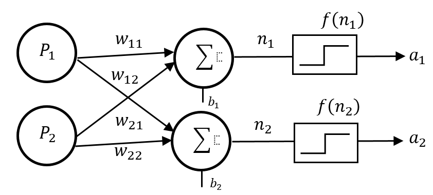
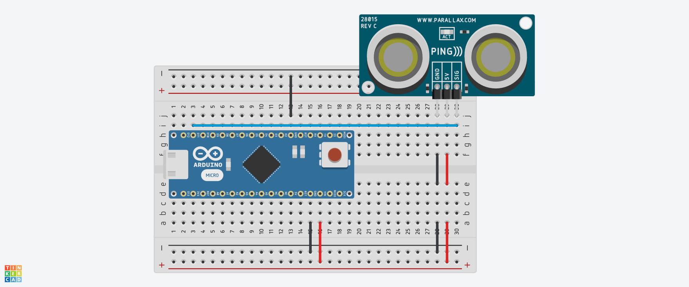
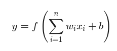

# TinyML Distance Classifier: Perceptrón con Arduino y Python

Este proyecto implementa una red neuronal de **3 perceptrones** entrenada para clasificar distancias detectadas por un sensor ultrasónico. El flujo de trabajo incluye la recolección de datos, el entrenamiento en Python y el despliegue de los pesos ($w$) y sesgos ($b$) en un microcontrolador para ejecución en el borde (Edge Computing).

---

## Diagrama del Circuito

*Conexión de sensor ultrasónico de 3 pines (SIG) a los pines de alimentación y señal del Arduino Nano.*

---

## Estructura del Proyecto

El repositorio sigue una organización modular para facilitar el mantenimiento y la escalabilidad:

* **`arduino/`**: Contiene el código fuente `.ino` para el Arduino Nano.
* **`data/`**: Almacena los archivos `Values.csv` con las lecturas para el modelo.
* **`docs/`**: Documentación técnica, diagrama y reporte del proyecto.
* **`src/`**: Script principal para la interfaz gráfica y comunicación serial en tiempo real.
* **`training/`**: Lógica de entrenamiento de la red neuronal en Python.
* **`tests/`**: Pruebas unitarias para validar la conexión de periféricos.

---

##Stack Tecnológico

| Componente | Tecnología / Modelo |
| :--- | :--- |
| **Microcontrolador** | Arduino Nano (ATmega328P) |
| **Sensor** | Ultrasónico HC-SR04 ó Parallax PING (3-pines) |
| **Lenguajes** | C++ (Arduino) y Python 3.10+ |
| **Librerías Python** | Pandas, NumPy, PySerial, CustomTkinter |
| **Diseño** | Tinkercad / Fritzing |

---

##  Guía de Configuración

### 1. Preparación del Entorno
Instala las dependencias necesarias en tu entorno de Python:

    pip install -r requirements.txt

### 2. Entrenamiento del Modelo

Ejecuta el script de entrenamiento para procesar los datos de **data/Values.csv.** El script generará un arreglo de C en la consola:

    python training/Train_model.py

### 3. Carga al Microcontrolador

Copia el arreglo generado por Python.

Abre **arduino/Neuronal_network.ino.**

Sustituye los valores de los pesos en la sección de variables globales.

Sube el código al Arduino.

### 4. Visualización en Tiempo Real

Inicia la interfaz gráfica para observar la clasificación en vivo:

    python src/Serial_connection.py

## Fundamentos del Perceptrón Simple

Cada perceptrón en este sistema procesa la entrada de distancia aplicando una suma ponderada y una función de activación:
 

Donde:

xi​: Es la distancia normalizada recibida del sensor.

wi​: Son los pesos ajustados durante el entrenamiento para minimizar el error.

b: El sesgo que permite desplazar la función de activación.

## Autor: Oscar Efrén Jiménez García 
**Ingeniería en Computación FES Aragón, UNAM**
